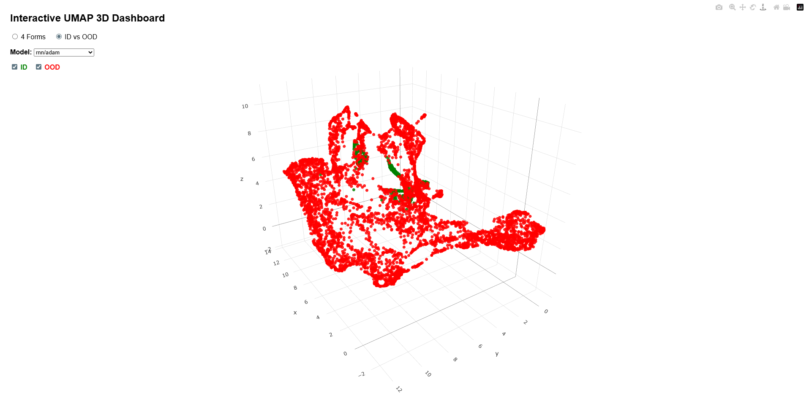

## Interactive 3D UMAP OF Poomsae detection with 2 options:

* 3D UMAP of **Poomsae detection** based on models and optimizers with filtering by forms (1 to 4)
* 3D UMAP of **OOD detection** based on models and optimizers with filtering by ID and OOD

### URL: 
https://salehghotbani.github.io/poomsae_umap/

### DEMO:

